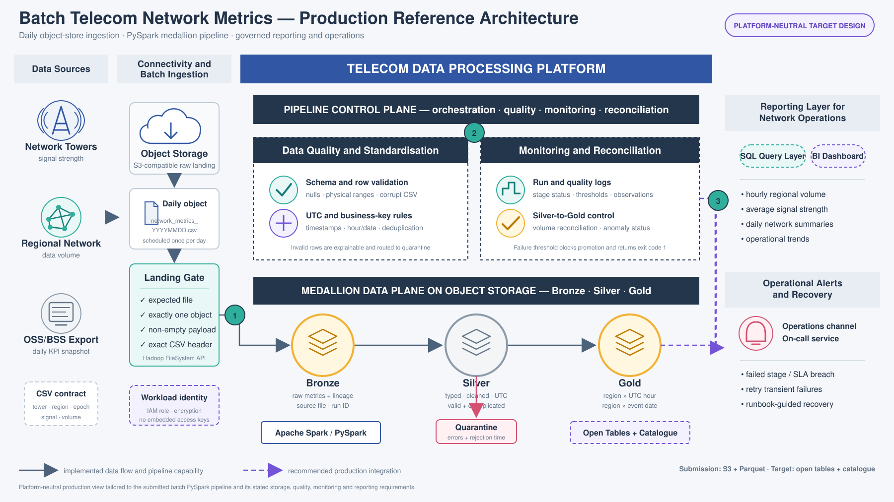

Telecom Network Metrics Pipeline

## Scope

This repository implements an end-to-end network performance metrics pipeline
using PySpark and the Medallion architecture. It ingests raw cell-tower metrics
from CSV files, applies schema and data-quality validation, creates Bronze and
Silver datasets, and publishes hourly and daily regional metrics in the Gold
layer. Pipeline runs, quality results and detected anomalies are also persisted
for operational monitoring.

The pipeline runs locally using the supplied sample data and Parquet storage.
Its configurable input and output paths also support S3 through Spark’s S3A
connector, allowing the same application to be deployed on a compatible managed
Spark platform.

An optional Airflow 3 reference DAG illustrates how a production orchestrator
could wait for a daily S3 object, submit the idempotent Spark application, apply
bounded retries and trigger failure or recovery notifications. Airflow is not
required to run the pipeline, and the reference DAG was not deployed or executed
as part of this submission.

## Architecture

The architecture separates the **Pipeline Control Plane**—orchestration, data
quality, monitoring and reconciliation—from the **Medallion Data Plane**—Bronze,
Silver and Gold datasets stored on object storage. The control plane governs and
observes the data flow; it is not an additional data layer.

[](docs/network_metrics_reference_architecture.png)

*Figure 1: Reference architecture for the network metrics pipeline. Select the
image to view it at full size.*

See the [architecture documentation](docs/architecture.md) for detailed design
decisions and the mapping between implemented components and potential
production extensions.

## Storage model

All medallion layers use **Parquet files**:

```text
output/
├── 01_bronze/network_metrics/
├── 02_silver/network_metrics/
├── 02_silver/network_metrics_quarantine/
├── 03_gold/region_hourly_metrics/
├── 03_gold/region_daily_metrics/
└── 04_monitoring/
    ├── pipeline_run_logs/
    ├── data_quality_logs/
    ├── processing_manifest/
    └── hourly_anomalies/
```
Input and output roots are configurable. They may be local folders, HDFS
locations, or S3 URIs supported by the supplied Spark runtime. See the
[S3 deployment guide](docs/s3_deployment.md) for the concrete S3 prefix mapping.

## Project structure

```text
telecom-network-metrics-pipeline/
├── config/
│   ├── pipeline.example.json
│   └── pipeline.s3.example.json
├── docs/
│   ├── architecture.md
│   ├── assignment_compliance.md
│   ├── s3_deployment.md
│   ├── s3_operations_runbook.md
│   ├── submission_guide.md
│   └── operations_runbook.md
├── logs/                         # example validation logs
├── mock_tables/                  # requested mock layer views
├── notebooks/
│   └── 01_end_to_end_demo.ipynb # runnable reviewer walkthrough
├── orchestration/airflow/  # optional orchestration reference
├── sample_data/
│   └── network_metrics_20250723.csv
├── scripts/
│   ├── 01_bronze/
│   ├── 02_silver/
│   ├── 03_gold/
│   ├── 04_monitoring/
│   ├── check_environment.ps1
│   ├── run_local.sh
│   └── run_local.ps1
├── src/network_metrics/
│   ├── config.py
│   ├── filesystem.py
│   ├── jobs.py
│   ├── manifest.py
│   ├── anomaly.py
│   ├── alerting.py
│   ├── main.py
│   ├── paths.py
│   ├── quality.py
│   ├── schema.py
│   └── transforms.py
├── tests/
├── pyproject.toml
├── requirements.txt
└── README.md
```

The staged script folders preserve the clear structure of the supplied example,
but each file is a standard Python entry point suitable for `spark-submit`.
The notebook imports the same modules; it does not maintain a second copy of the
business logic.

Operational setup, validation, failure handling and recovery procedures are in
the [local Operations Runbook](docs/operations_runbook.md). The repeatable
Windows/VS Code procedure for executing the same pipeline against S3 is in the
[S3 Operations Runbook](docs/s3_operations_runbook.md).

## Task breakdown and pipeline flow

```text
Bronze -> Silver -> Hourly Gold -> Daily Gold -> Monitoring
```

Running `--stage all` executes the stages sequentially in one Spark application.
Individual stages may also be run separately.

## Bronze

Responsibilities:

- find the expected `network_metrics_YYYYMMDD.csv` file;
- validate that exactly one file exists;
- validate filename, non-zero size and exact header;
- read with an explicit PySpark schema;
- retain corrupt CSV content;
- add file, pipeline, run and processing metadata;
- calculate a SHA-256 source identity and write complete lineage;
- retain Bronze history partitioned by ingestion date and run ID;
- skip an identical source that already has a successful manifest entry.

## Silver

Responsibilities:

- trim `region`;
- convert Unix seconds to a UTC timestamp;
- derive the complete hourly timestamp and event date;
- validate required values and physical ranges;
- detect duplicate provisional event keys;
- write hard failures to a Parquet quarantine dataset;
- retain warning-only rows;
- rebuild only affected event-date partitions from retained Bronze history;
- publish the latest version of each business key across corrections and
  cross-midnight batches.

The provisional event key is:

```text
(region, tower_id, timestamp)
```

It includes region because the supplied sample reuses tower IDs across regions.
The source-system owner should confirm the final key.

Duplicate detection is scoped to one ingestion run. Duplicate keys inside one
source file are quarantined. Across runs, the latest received version wins and
only affected `event_date` partitions are replaced. Ranking occurs before the
quality filter so an invalid correction cannot expose an older valid version.

## Gold

### Hourly grain

```text
(region, event_hour_utc)
```

Measures:

- total `data_volume_mb`;
- average `signal_strength`;
- record count;
- distinct tower count.

### Daily grain

```text
(region, event_date)
```

Measures:

- total `data_volume_mb`;
- average `signal_strength`;
- record count;
- distinct tower count.

The implementation groups by the complete hour timestamp, not hour-of-day, so
records from different dates cannot be mixed.

## Data quality

### Landing checks

- expected file is present;
- exactly one file for the processing date;
- filename follows the contract;
- file is not empty;
- CSV header matches the five required columns.

### Row checks

- required fields are not null;
- tower ID is positive;
- region is not blank;
- timestamp is parseable;
- signal strength is within the configurable range;
- data volume is non-negative;
- provisional event key is unique within the incoming file.

### Quality policy

- invalid rows are written to quarantine;
- invalid rate at or above 0.1% produces a warning;
- invalid rate at or above 1% fails the Spark application;
- filename-date/event-date mismatches remain valid warnings;
- Silver is reconciled with hourly and daily Gold for group presence, total
  volume, average signal strength, record count and distinct tower count.

Quality and run results are stored as Parquet files under `04_monitoring`.
The supplied JSONL evidence includes a clearly labelled synthetic failing run
to demonstrate error handling. Silver promotion is blocked before any affected
partition is updated when the failure threshold is exceeded.

## Sample-data findings

The supplied sample contains 100 records. Four records have an event date of
2025-07-24 even though the file is named for 2025-07-23. These records are
retained as `VALID_WITH_WARNING`, and the actual event date drives Gold output.

Historical anomaly detection is implemented for every region and UTC hour. It
uses up to 28 prior days, median/MAD robust scores and configurable minimum
history. The one-day sample correctly returns `INSUFFICIENT_HISTORY`; after at
least seven comparable observations, deviations in volume, signal, record count
and active towers are persisted with explainable reasons.

## Monitoring and alerting

The Spark application writes a run record after every successful or failed
stage. On failure it also:

1. logs an `INCIDENT` message;
2. raises the original exception;
3. exits with status code 1.

The included Airflow workflow implements the production alert path outside the
transformation code:

```text
Spark exit status / DQ event -> orchestrator -> SNS or event bus -> on-call + Teams
```

- retry a failed submission twice with exponential backoff; the manifest makes
  each attempt safe and prevents an already-completed source being republished;
- page the on-call engineer for a failed stage or a missing file after the data
  availability SLA;
- send warning-level DQ and anomaly events to the operations channel without a
  page;
- deduplicate incidents by processing date, run ID and stage;
- include the failed check, observed/expected values, last successful run and a
  runbook link in every notification;
- send one recovery notification when a retry succeeds.

An optional [Airflow reference DAG](orchestration/airflow/dags/network_metrics_pipeline.py)
illustrates the production alerting integration. See the
[orchestration documentation](docs/orchestration.md) for details. In a configured
deployment, the webhook can target a Teams workflow or enterprise alert relay.
Without a webhook URL, the same structured JSON is emitted as an `ALERT_EVENT` log.
The Airflow workflow was not deployed or executed as part of this submission.

## Running locally

Prerequisites:

- Java supported by the installed Spark version;
- Python 3.11;
- PySpark;
- `winutils.exe` and `hadoop.dll` only when required by the selected Windows
  Spark/Hadoop distribution.

Linux/macOS:

```bash
python -m venv .venv
source .venv/bin/activate
pip install -r requirements.txt
bash scripts/run_local.sh
```

Windows PowerShell:

```powershell
python -m venv .venv
.\.venv\Scripts\Activate.ps1
pip install -r requirements.txt
.\scripts\check_environment.ps1
.\scripts\run_local.ps1
```

### Reviewer demo notebook

Install the optional demo and test dependencies, then open the notebook:

```powershell
pip install -e ".[test,demo]"
jupyter lab notebooks\01_end_to_end_demo.ipynb
```

Use **Run All**. The notebook executes Bronze, Silver, hourly Gold, daily Gold
and monitoring, then shows the layer outputs, warning records, run logs and a
synthetic invalid-row example. Generated data stays under a unique
`output/demo/<run-id>/` folder so repeated demonstrations cannot interfere with
each other. Reviewers without a local Spark runtime can inspect the verified
CSV results under `mock_tables/` and the PASS/WARN/FAIL examples under `logs/`.

Direct invocation:

```bash
export PYTHONPATH="$PWD/src"
spark-submit src/network_metrics/main.py \
  --config config/pipeline.example.json \
  --input-path sample_data \
  --output-root output \
  --processing-date 2025-07-23 \
  --stage all
```

## Running on another Spark environment

Package and submit the same Python source. Override the paths with URI strings
supported by that Spark runtime:

```bash
spark-submit src/network_metrics/main.py \
  --config config/pipeline.example.json \
  --input-path <spark-compatible-input-path> \
  --output-root <spark-compatible-output-path> \
  --processing-date 2025-07-23 \
  --stage all
```
For S3, the [example S3 configuration](config/pipeline.s3.example.json) contains
the one-bucket layout used for the assessment scenario. Replace the bucket name
when deploying to another AWS account and supply a compatible S3A connector
through the Spark runtime. The application contains no cloud credentials,
workspace URLs or cluster definitions. The Windows procedure is documented in
the [S3 operations runbook](docs/s3_operations_runbook.md), while the portable
deployment mapping is covered in the
[S3 deployment guide](docs/s3_deployment.md).

## Tests

```bash
pip install -e ".[test]"
pytest -q
```

The 24 tests cover timestamp conversion, the midnight boundary, invalid rows,
the required Gold calculations, run-scoped duplicate handling, deterministic
latest-record selection, strict hourly/daily reconciliation, run-ID enforcement,
stale-quarantine cleanup, incremental corrections, manifest idempotency,
configuration validation, median/MAD anomaly scoring, alert delivery, recovery
semantics and preservation of original stage exceptions.

## Assumptions

1. Source timestamps are Unix epoch seconds.
2. Reporting uses UTC unless configuration specifies another Spark timezone.
3. Signal strength is measured in dBm.
4. Negative data volume is invalid.
5. Cross-midnight rows may be legitimate.
6. Each daily file is an event batch; corrected keys may reappear in later files.
7. Bronze retains runs and Silver/Gold replace only affected event-date
   partitions. SHA-256 plus the manifest makes identical reruns idempotent.
8. Local and S3 execution use Parquet. A transactional table format is an
   optional future enhancement rather than a take-home dependency.
9. Optional visualisation is represented by the mock Gold CSV files and demo
   notebook rather than
   a deployed visualisation product.

## Running and inspecting one stage at a time

All separately submitted stages must receive the same `--run-id`. Silver uses
that value to locate the Bronze records created by the current pipeline run,
and the Gold and monitoring stages use it to determine the affected event dates.
The application fails explicitly rather than reporting a false success when the
run ID has no corresponding Bronze records.

Windows PowerShell:

```powershell
.\scripts\run_stage_by_stage.ps1
```

Linux/macOS:

```bash
bash scripts/run_stage_by_stage.sh
```

The runner executes and previews:

1. Bronze;
2. Silver and its quality log;
3. hourly Gold;
4. daily Gold;
5. final reconciliation and run logs.

To inspect one dataset again:

```powershell
$env:PYTHONPATH = "$PWD\src;$env:PYTHONPATH"
spark-submit scripts\preview_output.py `
  --output-root output `
  --dataset gold-daily `
  --rows 20
```

Valid preview dataset names are `bronze`, `silver`, `quarantine`,
`gold-hourly`, `gold-daily`, `run-logs`, `quality-logs`, `manifest`, and
`anomalies`.
