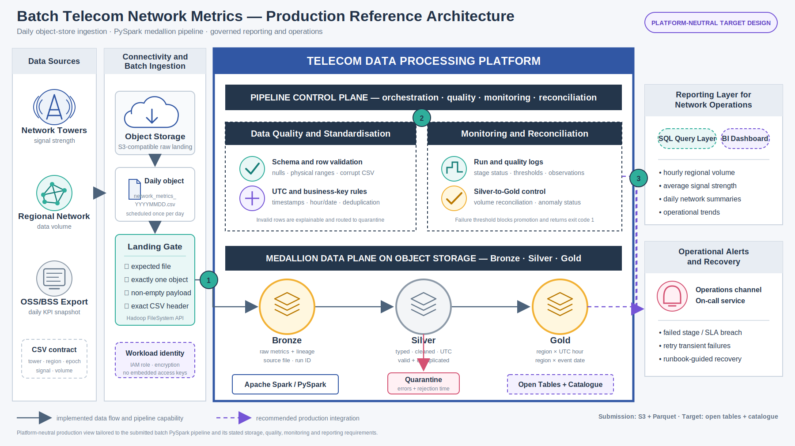

# Architecture



## Overview

This solution processes the daily telecom network metrics file from Amazon S3
using a PySpark batch pipeline. It validates the incoming file, preserves the
raw data for traceability, cleans and standardises valid records, quarantines
invalid records, and produces hourly and daily summaries for the network
operations team.

The design follows the Bronze-Silver-Gold medallion pattern requested in the
assignment. It also adds practical controls for data quality, monitoring,
reconciliation and incident handling.

The architecture diagram distinguishes between two types of components:

- **Solid lines and boxes** show capabilities implemented by the submitted
  PySpark solution.
- **Violet dashed lines and boxes** show recommended production integrations,
  such as an external alerting service, catalogue, open-table format or BI
  platform.

Streaming, machine learning and model serving are intentionally excluded
because they are outside the scope of this batch-processing assignment.

## End-to-end data flow

The pipeline follows this sequence:

1. **Detect the daily source file**
   
   The expected input is:

   ```text
   s3a://raw-telecom-network-data/network_metrics_YYYYMMDD.csv
   ```

   The landing checks confirm that exactly one file matches the expected name
   for the processing date, that it is not empty, and that it contains the
   expected CSV header.

2. **Write the Bronze layer**
   
   Bronze preserves the received records with minimal transformation. Lineage
   columns such as the source file, processing date, ingestion timestamp and
   run ID are added so that every record can be traced back to its source.

3. **Build the Silver layer**
   
   Silver converts the source fields to their expected data types, converts the
   Unix timestamp to UTC datetime fields, applies row-level quality rules and
   removes duplicate network measurements.

4. **Route rejected records to quarantine**
   
   Invalid records are not silently discarded. They are written to quarantine
   with one or more rejection reasons and a quarantine timestamp. This makes
   failures explainable and supports investigation or controlled replay.

5. **Create Gold aggregates**
   
   Gold produces the outputs requested by the assignment:

   - Total `data_volume_mb` per region and UTC hour.
   - Average `signal_strength` per region and UTC hour.
   - Total `data_volume_mb` per region and day.
   - Average `signal_strength` per region and day.

   Row counts and distinct tower counts are also retained as useful operational
   context.

6. **Record monitoring results**
   
   Each stage writes operational information such as its status, timestamps,
   row counts, thresholds, observed values and error details. A Silver-to-Gold
   reconciliation check confirms that valid data volumes have not been lost or
   duplicated during aggregation.

## Control plane and data plane

The upper part of the diagram represents the **pipeline control plane**. It is
not another medallion layer. Scheduling, quality gates, monitoring,
reconciliation, retry behaviour and incident notifications operate across
several processing stages, so they are shown above the main data flow.

The lower part represents the **medallion data plane** on object storage. This
is where the Bronze, Silver, Gold and quarantine datasets are stored.

```text
Daily S3 CSV -> Landing checks -> Bronze -> Silver -> Gold
                                            |
                                            +-> Quarantine
```

## Data model by layer

| Layer | Grain | Main fields | Purpose |
| --- | --- | --- | --- |
| Source/landing | One CSV file per processing date | Original CSV file | Daily hand-off and replay source |
| Bronze | One received CSV record | Five source fields plus source file, processing date, ingestion timestamps and run ID | Preserve auditable source history |
| Silver | One valid, deduplicated measurement per tower, region and event timestamp | Typed source fields, UTC timestamp, event hour/date and quality results | Provide clean analytical events |
| Quarantine | One rejected measurement | Bronze/Silver fields plus rejection reasons and quarantine timestamp | Explain and investigate invalid records |
| Gold hourly | One row per region and UTC hour | Total volume, average signal strength, row count and distinct tower count | Monitor hourly regional network activity |
| Gold daily | One row per region and event date | Total volume, average signal strength, row count and distinct tower count | Provide the required daily summary |
| Monitoring | One row per run, stage or quality check | Status, threshold, observation, error and timestamps | Support audit, SLA tracking and incident investigation |

## Data-quality and reconciliation controls

Quality checks are placed as close as possible to the point where a problem can
be detected.

| Check area | Examples | Pipeline response |
| --- | --- | --- |
| File arrival and freshness | Expected daily filename is present within the agreed processing window | Mark the run as failed or late and raise a high-severity event |
| File contract | Exactly one matching file, non-empty content and exact CSV header | Stop processing before Bronze publication |
| Schema validation | Expected columns and compatible data types | Quarantine invalid rows or fail the file if the contract is unusable |
| Completeness | Required fields are not null | Add an explainable rejection reason and route the row to quarantine |
| Validity | Timestamp and numeric values are parseable; signal strength and volume are within configured limits | Quarantine the invalid row and record the observed failure rate |
| Uniqueness | Repeated tower, region and event-timestamp combinations | Retain one deterministic record and report the duplicate count |
| Anomaly monitoring | Invalid-rate or volume behaviour exceeds configured warning/failure thresholds | Record a warning or block Gold promotion, depending on severity |
| Reconciliation | Silver and Gold totals/counts remain consistent | Fail the run if aggregation loses or duplicates valid data |

Warning thresholds make unusual behaviour visible without unnecessarily
stopping the pipeline. Failure thresholds block promotion to Gold and return a
non-zero process status so that the scheduler or deployment platform can detect
the failure.

## Storage and processing choices

The submitted implementation uses Parquet because it is columnar, efficient
for analytical queries and easy for reviewers to run locally without requiring
a metastore. The same PySpark code can access S3 through Spark's S3A connector
when the required Hadoop AWS dependencies and workload credentials are
available.

The target storage layout uses separate prefixes for Bronze, Silver, Gold,
quarantine and monitoring data. The exact output bucket is configurable rather
than embedded in the application.

The partitioning approach is deliberately simple:

- **Bronze** is partitioned by ingestion date. `run_id` remains a lineage
  column rather than a partition, avoiding a large number of tiny partitions.
- **Silver and Gold** are partitioned by `event_date`, allowing the pipeline to
  read or replace only affected dates.
- **Region** remains a regular column. Partitioning by both date and a
  low-cardinality region field could create many small files without providing
  enough benefit for this data volume.

A SHA-256 processing manifest prevents the same successfully processed source
file from being published twice. A failed file remains eligible for retry.
Late-arriving or corrected data can be handled by replacing only the affected
date partitions instead of rebuilding the complete history.

## Orchestration and incident handling

PySpark is the main processing engine and contains the core pipeline logic.
This satisfies the assignment's choice of using **Airflow or Spark**.

The repository also includes a small Airflow reference DAG as an optional
production orchestration example. It can wait for the expected S3 object,
submit one idempotent Spark run, apply bounded retries and invoke failure or
recovery callbacks. Airflow is not required to run the local PySpark demo and
does not replace any part of the medallion pipeline.

In a production environment, notification callbacks can be connected to the
organisation's chosen service, such as Microsoft Teams, Slack, email or an
on-call platform. Credentials and webhook endpoints should be supplied through
the deployment environment and never committed to source control.

An actionable incident notification should include:

- Processing date and run ID.
- Failed stage or quality check.
- Error type and message.
- Observed value and expected threshold.
- Last successful run.
- Relevant data location.
- Link to the operations runbook.

Pipeline failures, missed freshness SLAs and failure-level data-quality breaches
should generate high-severity notifications. Warning-level anomalies can be
sent to an operations channel for review. Repeated notifications should be
deduplicated using the processing date, run ID and failed stage, and a recovery
message should be issued when a retry succeeds.

## Production recommendations and future extensions

The following improvements are useful for a production deployment but are not
required to demonstrate the assignment:

- Enable S3 versioning, encryption and lifecycle rules based on the agreed
  retention policy.
- Use workload roles instead of storing AWS access keys in code or
  configuration files.
- Run Spark on an ephemeral or serverless platform with dynamic allocation and
  appropriately sized shuffle partitions.
- Use Parquet predicate pushdown and column pruning, and compact small files
  towards the platform's preferred target size, commonly 128-512 MiB.
- Send operational events to a consolidated logging and monitoring service, or
  periodically compact retained Parquet logs rather than creating many small
  log files.
- Add Superset or another BI tool if an operational dashboard is required.
- Consider Apache Iceberg or another open-table format if future requirements
  include atomic multi-writer updates, schema evolution or time travel.
- Add a data catalogue later if users need central table discovery, ownership,
  schema documentation and access governance.

Open tables and a catalogue are therefore shown as future extensions, not as
features already implemented by the submission.

## Alignment with the assignment

| Assignment requirement | Where it is addressed |
| --- | --- |
| Detect and collect the daily S3 file | File detection and landing checks |
| Bronze-Silver-Gold processing | Medallion data plane |
| Convert Unix timestamps | Silver standardisation |
| Hourly regional aggregation | Gold hourly dataset |
| Daily regional summary | Gold daily dataset |
| File, schema, null and anomaly checks | Data-quality controls and quarantine |
| Monitoring of quality checks | Monitoring events, thresholds and stage status |
| Proposed data models | Layer-level grain and field table |
| Failure notifications and retry strategy | Orchestration and incident handling |
| Partitioning, cost and scalability considerations | Storage choices and production recommendations |

## Assumptions

- One source file is expected for each processing date.
- Source timestamps are Unix timestamps and are standardised to UTC.
- A network measurement is uniquely identified by `tower_id`, `region` and the
  event timestamp. If the source system provides a dedicated event ID, that ID
  should replace this provisional key.
- Invalid records must remain explainable and are therefore quarantined rather
  than silently dropped.
- The source file remains available for replay according to the agreed
  retention policy.
- Streaming ingestion and machine-learning use cases are outside the current
  assignment scope.

## Diagram files

- `network_metrics_reference_architecture.svg` provides the source diagram.
- `network_metrics_reference_architecture.png` provides a broadly compatible
  rendered version.
